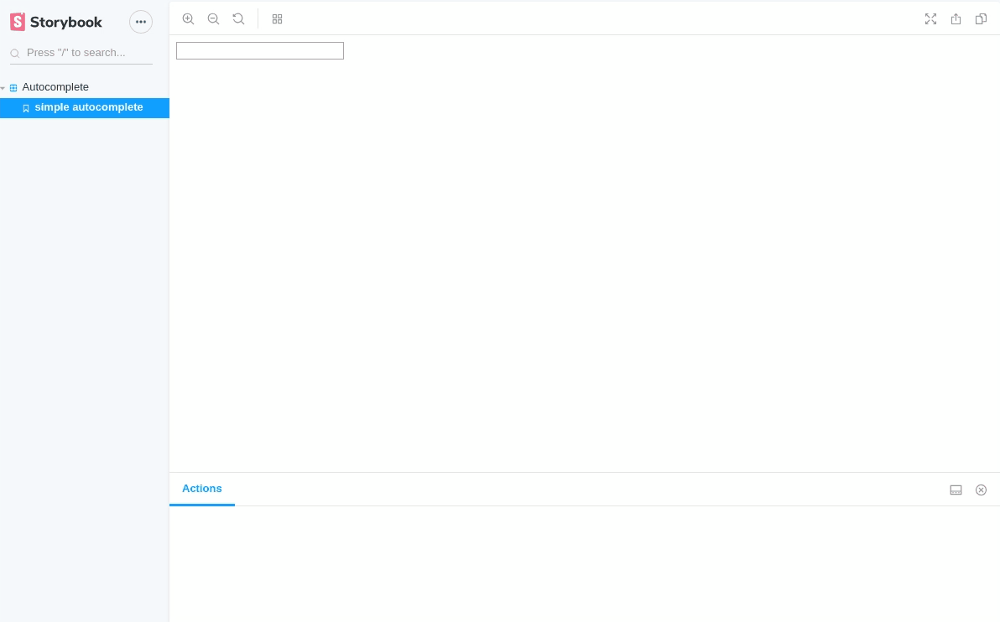

# React Autocomplete

[](https://www.npmjs.com/package/@fiveem/react-autocomplete)

React autocomplete that uses debounce.
In order to select a value from the autocomplete, the arrow up/down keys and mouse can be used.

## Screenshots




## Install

```
npm i @fiveem/react-autocomplete
```

## Usage

```JSX
import Autocomplete from '@fiveem/react-autocomplete'

<Autocomplete   suggestions={this.state.suggestiona}
                inputValue={this.state.inputValue}
                debounceTime={this.state.debounceTime}
                onChange={this.onChange}
                containerStyle={this.state.containerStyle}
                inputStyle={this.state.inputStyle}
                autocompleteStyle={this.state.autocompleteStyle}
                suggestionStyle={this.state.suggestionStyle}
                selectedSuggestionStyle={this.state.selectedSuggestionStyle}/>
```

## API
|name|type|sample value|description|
|----|----|------------|-----------|
|suggestions|Array|`['Romania', 'Spain', 'Italy', 'Georgia']`|Suggestions that will be displayed inside the autocomplete|
|inputValue|Number/String|20/Spain|The value that will be displayed inside the input)|
|debounceTime|Number|`1000`|When the user ends typing in the input, the onChange method will be called after debounceTime seconds (debounceTime should be specified in miliseconds). Default value is 500 ms.`|
|onChange|Function||Function that is called when the input value changes|
|containerStyle|Object||Style that will be applied on the container|
|inputStyle|Object||Style that will be applied on the input|
|autocompleteStyle|Object||Style that will be applied on the autocomplete container|
|suggestionStyle|Object||Style that will be applied on the suggestion (the list of items that is displayed inside the autocomplete container)|
|selectedSuggestionStyle|Object||Style that will be applied on the active/selected suggestion (on mouse hover or when the user uses the arrow up and arrow down keys)|

## License

react-autocomplete is released under the MIT license.
